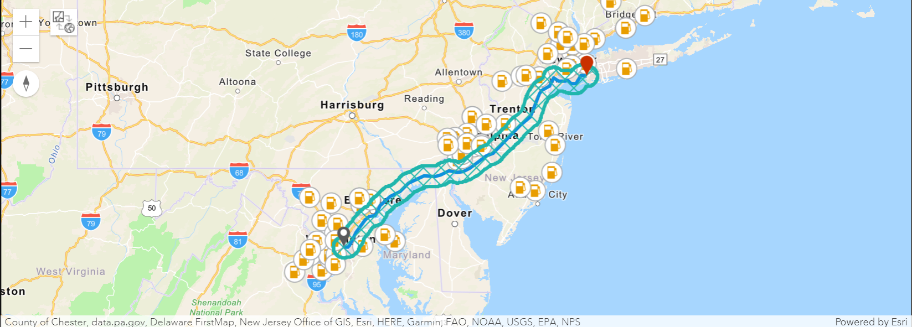
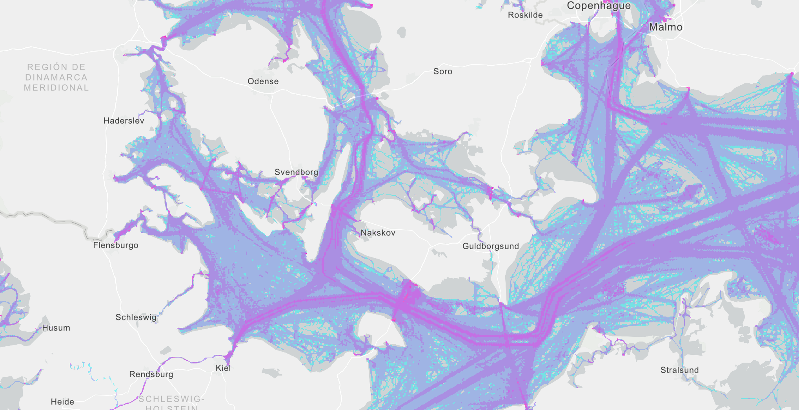
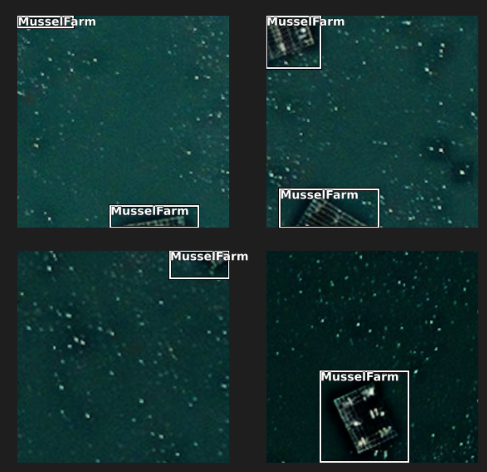
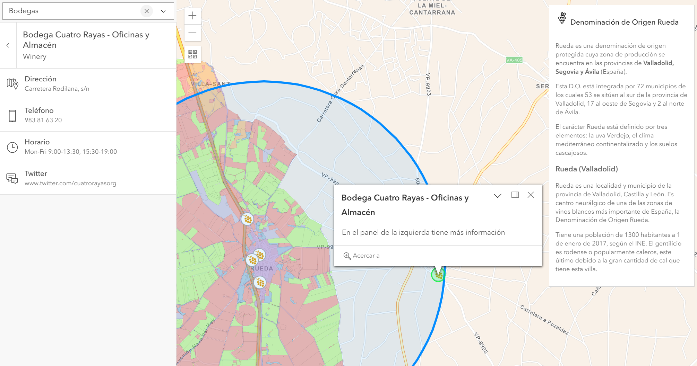
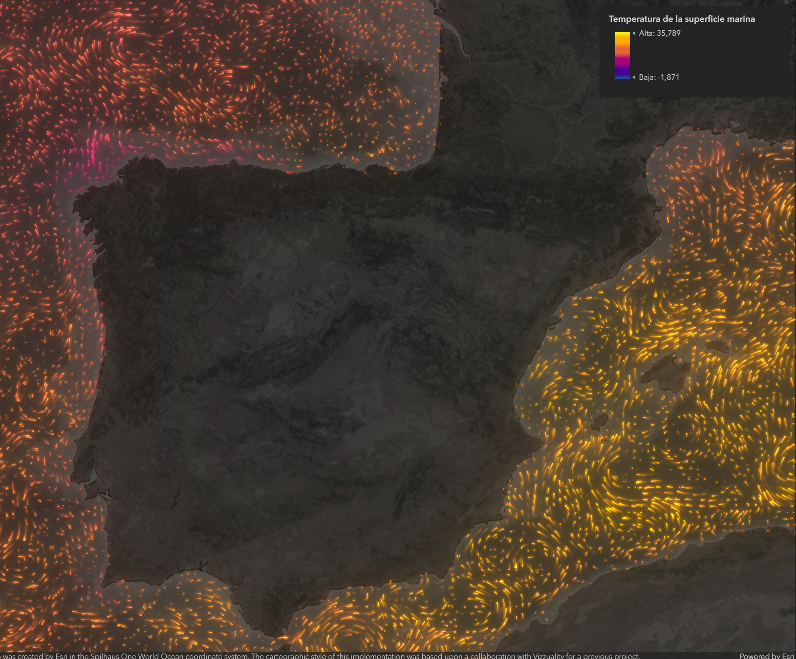

# 📊 🌍 Workshop Analítica avanzada 20 / 06 / 2023

En este repositorio podéis encontrar los códigos de los ejemplos que se han mostrado durante el workshop:

## El valor de la aproximación geográfica al ciclo de vida de un proyecto de datos.

* ArcGIS Notebook: Análisis de fraude. [Código](./AnalisisFraude.ipynb) 

* ArcGIS Notebook: Análisis de siniestralidad. [Código](./00_Accidentes_Madrid.ipynb)

## GeoAI: Capacidades analíticas geoespaciales avanzadas.
* ArcGIS GeoAnalytics Engine: Análisis en tiempo real [Código](./geoanalyticsEngine.ipynb)

* Deep Learning en ArcGIS [Código](./Detecci%C3%B3nBateasIllaDeArousa.ipynb)

## Explotación de la Información. La importancia de la experiencia de usuario.
* ArcGIS Maps SDK for JavaScript: Aplicación con renderizado personalizado con Arcade. [Código](./index.html) - [Aplicación](https://esri-es.github.io/workshop_analitica_avanzada/index.html)

* ArcGIS Maps SDK for JavaScript: Uso de suelo en Rueda y consulta de puntos de interés via API REST (2D). [Código](./indexPlaces2d.html) - [Aplicación](https://esri-es.github.io/workshop_analitica_avanzada/indexPlaces2d.html)
 

* ArcGIS Maps SDK for JavaScript: Uso de suelo en Rueda y consulta de puntos de interés via API REST (3D). [Código](./indexPlaces3d.html) - [Aplicación](https://esri-es.github.io/workshop_analitica_avanzada/indexPlaces3d.html)

* Renderizado de datos multidimensionales. [Código](./oceanCurrents.html) - [Aplicación](https://esri-es.github.io/workshop_analitica_avanzada/oceanCurrents.html)

## Enlaces de interés
- [ArcGIS Notebook](https://doc.arcgis.com/es/arcgis-online/get-started/get-started-with-notebooks.htm)
- [Página de desarrolladores de ArcGIS](https://developers.arcgis.com/)
- [Documentación de ArcPy](https://pro.arcgis.com/en/pro-app/latest/arcpy/main/arcgis-pro-arcpy-reference.htm)
- [Documentación de ArcGIS API for Python](https://developers.arcgis.com/python/)
- [Documentación de ArcGIS Maps SDK for JavaScript](https://developers.arcgis.com/javascript/latest/)
- [Servicios de localización de ArcGIS](https://developers.arcgis.com/documentation/mapping-apis-and-services/services/)
- [Colección de Postman de los servicios de localización de ArcGIS](https://www.postman.com/esridevs/workspace/arcgis-location-services/overview)
- [Constructor de simbología](https://sagewall.github.io/symbol-builder/)
- [Modelos de Deep Learning en ArcGIS Living Atlas](https://livingatlas.arcgis.com/en/browse/?q=dlpk#q=dlpk&d=2)
- [ArcGIS Velocity](https://www.esri.com/en-us/arcgis/products/arcgis-velocity/overview)
- [ArcGIS GeoAnalytics Engine](https://arcgis-geoanalytics-engine-preventas.hub.arcgis.com/)
